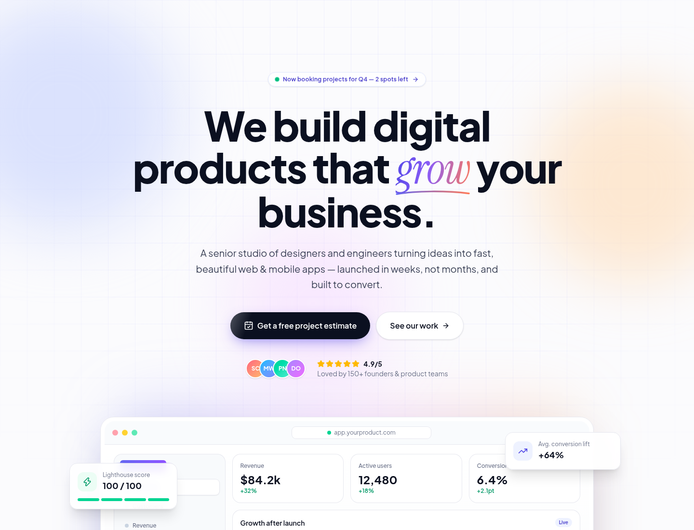

# Helix Studio — Dev Agency Website

A light-themed marketing site for a software/design agency, built with **Next.js 16 (App Router)**, **React 19**, **Tailwind CSS v4** and **TypeScript**.



## Sections

Sticky glass navbar · hero with an animated product mockup · client marquee · bento services grid · animated stats · case studies · 4-step process · testimonial marquee · pricing · FAQ accordion · contact form with project-type and budget chips · CTA footer.

Scroll-reveal animations respect `prefers-reduced-motion`, the layout is fully responsive, and the page is statically prerendered.

## Getting started

```bash
npm install
npm run dev      # http://localhost:3000
npm run build && npm start
```

## Customising

- **Brand, copy, services, pricing, FAQ**: all in `lib/site.ts`.
- **Colours & fonts**: design tokens in `app/globals.css` (`@theme`) and fonts in `app/layout.tsx`.
- **Contact form**: posts to `app/api/contact/route.ts`. Set `CONTACT_WEBHOOK_URL` (a Slack webhook, Zapier, Make, or your own endpoint) to receive leads. Without it, leads are logged to the server console.

> Client names, case studies, stats and testimonials in `lib/site.ts` are **placeholders**. Replace them with your real work and quotes before launching.
